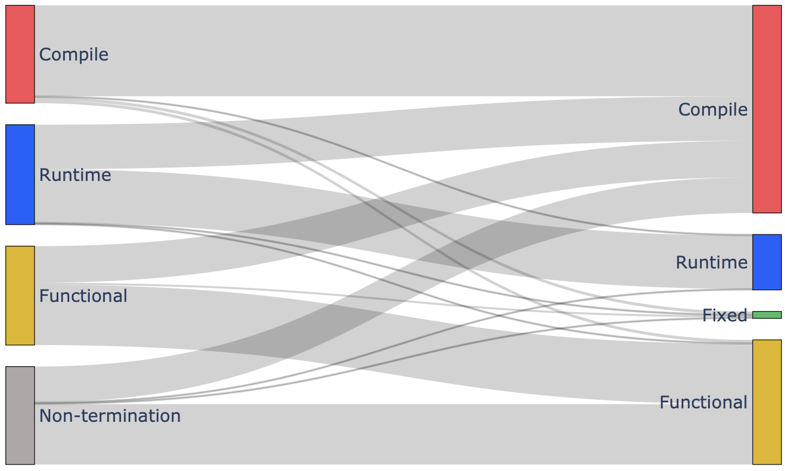
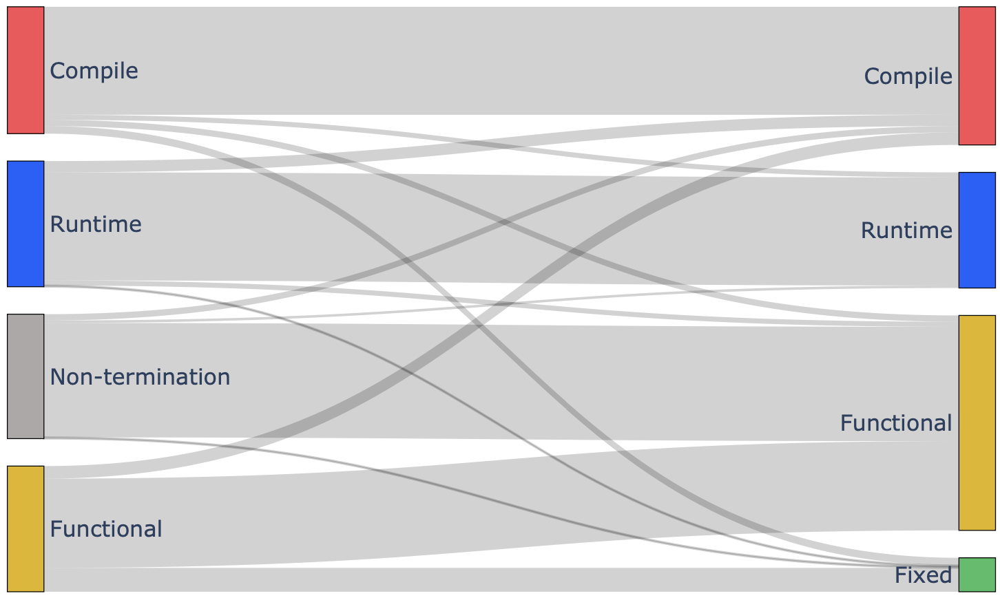

### Appendix

The following figures correspond to open-source LLMs (i.e., StarCoder, CodeGen, and LLaMa-2) which were used for mitigating translation bugs (similar to Figure 7).

1. CodeGen:

1. LLaMa-2:

1. StarCoder:

